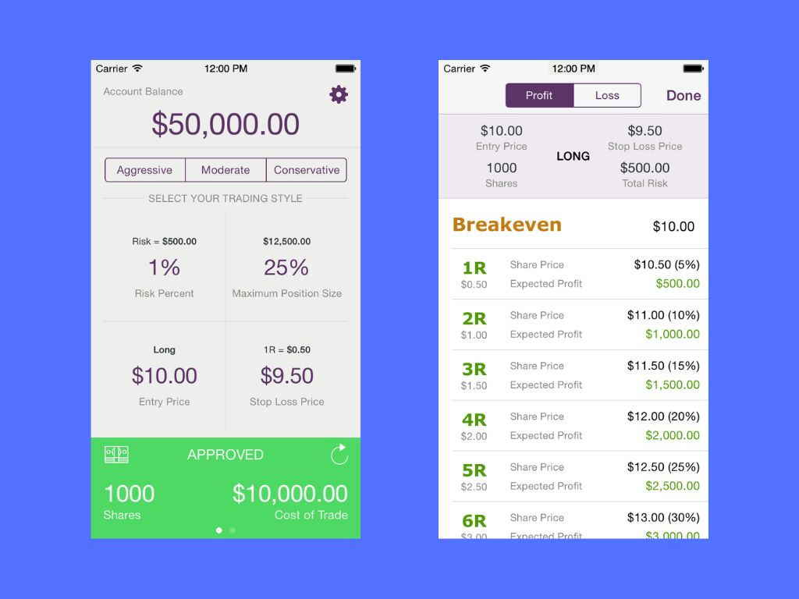

# Position Size Calculator

A professional iOS trading application that helps traders calculate appropriate position sizes based on risk management principles. The app determines how many shares to buy or sell based on account size, risk tolerance, entry price, and stop loss price.

## Features

- **Risk Management Calculations**: Calculates optimal position sizes using professional trading formulas
- **Multiple Trade Types**: Supports both long and short positions with proper validation
- **Trader Profiles**: Pre-configured risk profiles (Aggressive, Moderate, Conservative)
- **Commission Integration**: Factors in trading commissions for accurate calculations
- **Real-time Validation**: Ensures trade parameters are logically valid (entry vs stop prices)
- **Profit/Loss Projections**: Shows potential outcomes based on risk/reward ratios

## Core Calculations

The app implements standard trading risk management formulas:
- **Position Size** = Risk Amount ÷ Risk Per Share  
- **Risk Per Share** = |Entry Price - Stop Loss Price|
- **Risk Amount** = Account Size × Risk Percentage
- **Maximum Position** = Account Size × Max Position Size Percentage

## Technical Details

### Architecture
- **Swift/iOS**: Native iOS application built with UIKit
- **Dependency Management**: CocoaPods with PureLayout for Auto Layout
- **Analytics**: Integrated with Flurry Analytics for usage tracking

### Key Components
- **Custom UI Views**: Specialized components for displaying calculations and input controls
- **Modal Controllers**: Dedicated screens for balance, price, and percentage inputs
- **Data Persistence**: Uses NSUserDefaults for user preferences and settings

## Screenshots

See the [Screenshots](./Screenshots) directory for additional app screenshots and interface examples.

## Status

This project is archived and represents a completed iOS trading utility application.
